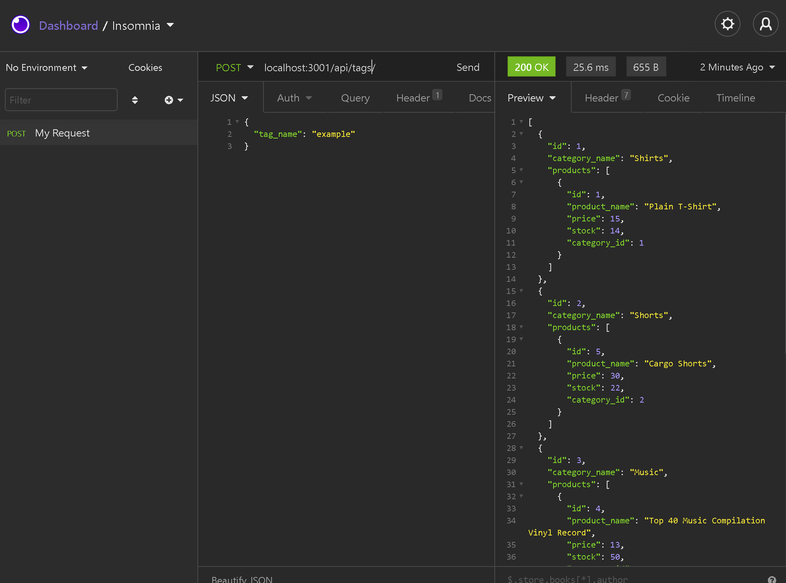

# iProduct

 ## Description
 This is an API created to hold data for an online merchant. This API allows users to GET PUT POST and DELETE items. The database uses associations to link Tags to Products, and Products to Categories. The database also contains a ProductTags model to hold meta data about which product belongs to which category etc.
  
  
  

  Watch the demo:
  [PART 1](https://www.youtube.com/watch?v=_btU5fJD9H4)
  [PART 2](https://www.youtube.com/watch?v=sjoSOcJXn_4)

 ## Getting Started:

If you want to edit this app you must have a Github account, have downloaded Node.js, Express.js, Visual Studio Code.

- Create a Github account here: [Github](https://github.com/)
- Download Visual Studio here: [Visual Studio](https://code.visualstudio.com/download/)
- Download Node.js: [Node.js](https://nodejs.org/en/)
- Repository link: [iProduct Repo](https://github.com/scottgeleas/iProduct)

 ### Authors:

 Scott Geleas

 ### Built With:

- Javascript
- Node.js
- Express.js
- Sequelize
- MySQL Server- Visual Studio Code

 ### Acknowledgments:

University of New Hampshire Coding Bootcamp

 ### License: 
 
MIT License

Copyright (c) [2021] [Scott Geleas]]

Permission is hereby granted, free of charge, to any person obtaining a copy
of this software and associated documentation files (the "Software"), to deal
in the Software without restriction, including without limitation the rights
to use, copy, modify, merge, publish, distribute, sublicense, and/or sell
copies of the Software, and to permit persons to whom the Software is
furnished to do so, subject to the following conditions:

The above copyright notice and this permission notice shall be included in all
copies or substantial portions of the Software.

THE SOFTWARE IS PROVIDED "AS IS", WITHOUT WARRANTY OF ANY KIND, EXPRESS OR
IMPLIED, INCLUDING BUT NOT LIMITED TO THE WARRANTIES OF MERCHANTABILITY,
FITNESS FOR A PARTICULAR PURPOSE AND NONINFRINGEMENT. IN NO EVENT SHALL THE
AUTHORS OR COPYRIGHT HOLDERS BE LIABLE FOR ANY CLAIM, DAMAGES OR OTHER
LIABILITY, WHETHER IN AN ACTION OF CONTRACT, TORT OR OTHERWISE, ARISING FROM,
OUT OF OR IN CONNECTION WITH THE SOFTWARE OR THE USE OR OTHER DEALINGS IN THE
SOFTWARE.